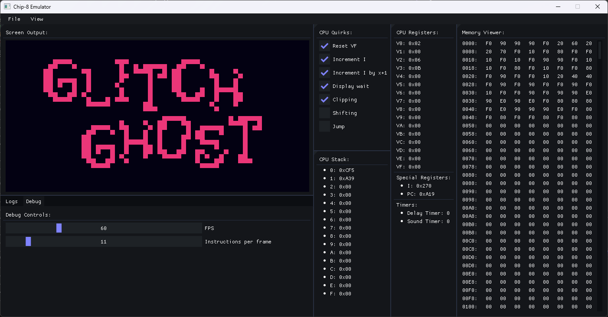

# Chip-8 Emulator


A pretty basic Chip-8 emulator with basic debugging UI and configurable quirks. 

## Features

- **Basic Debugging UI**: Allows you to step through instructions and view the state of the emulator.
- **Configurable Quirks**: Customize the behavior of the emulator to match different Chip-8 implementations.
- **ROM Database Support**: Planned feature for easy management and loading of Chip-8 ROMs.
- **SCHIP and XOCHIP Support**: Planned support for extended Chip-8 instructions.
- **Debugging and Disassembly**: Planned features including better debugging ui, disassembly and cpu state traversal.

## Contributing

1. Clone the repository:
   ```sh
   git clone https://github.com/url
   ```
2. (On Windows) Go to the cloned folder right click, click show more options and then click open with visual studio
3. (On Linux) Go to the cloned directory in the terminal and create a new directory named build, cd to build and type `cmake ../` 
